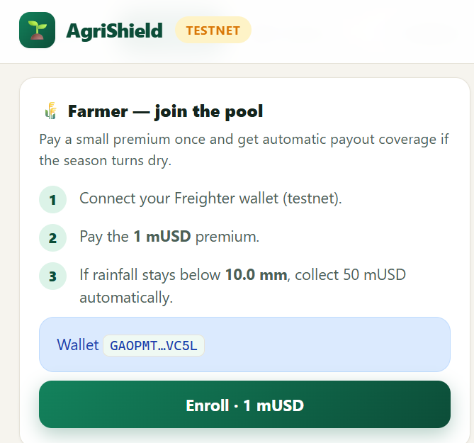
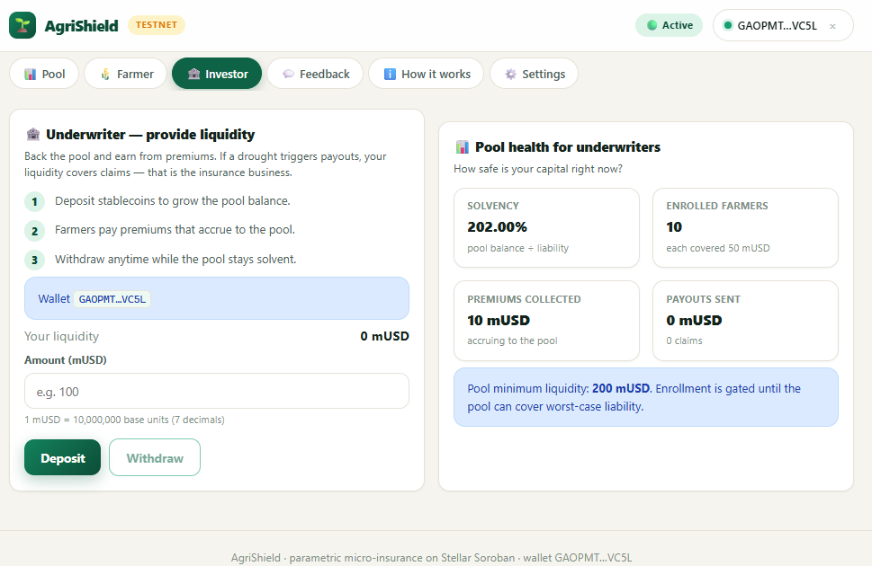
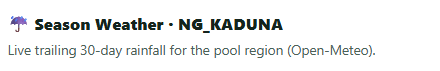
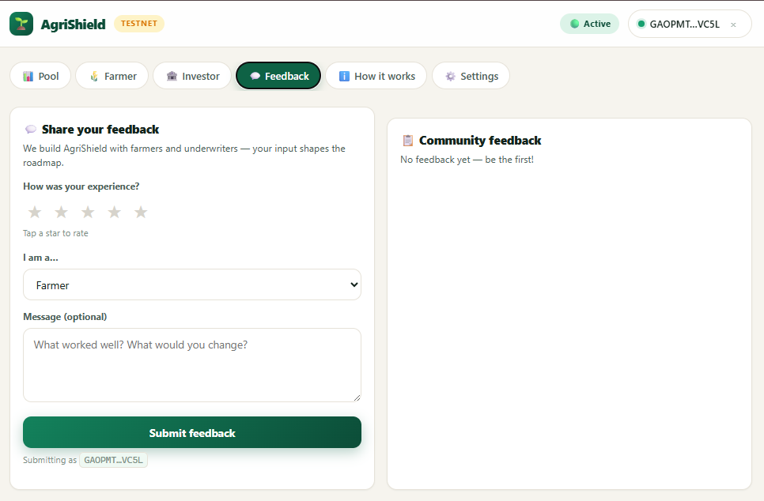
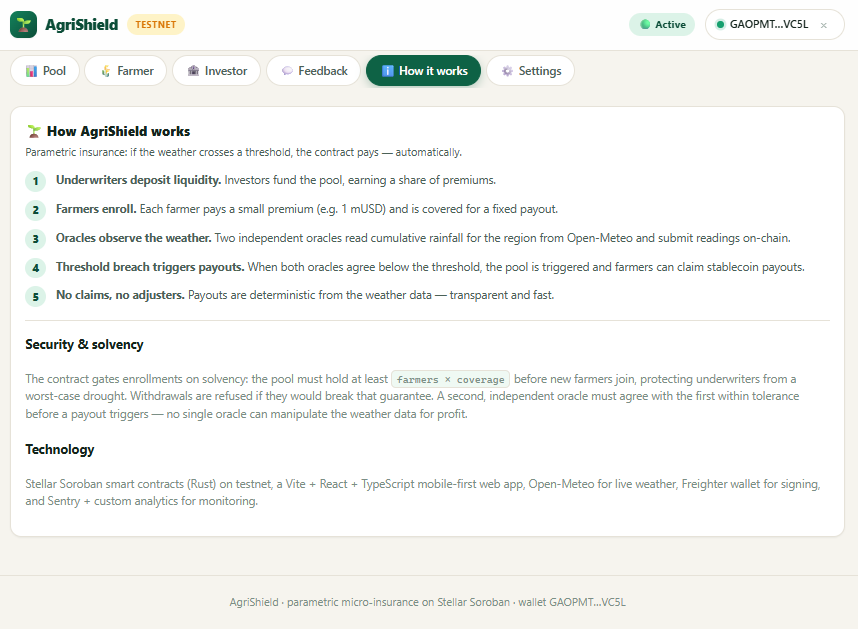

# 🌾 AgriShield — Parametric Micro-Insurance Pool

> Weather-indexed micro-insurance for smallholder farmers on Stellar/Soroban

[](https://testnet.stellar.org)
[](https://soroban.stellar.org)
[](LICENSE)

---

## 📋 Table of Contents

- [Overview](#overview)
- [How It Works](#how-it-works)
- [Architecture](#architecture)
- [Live Deployments](#live-deployments)
- [Smart Contracts](#smart-contracts)
- [Frontend](#frontend)
- [Oracle](#oracle)
- [Screenshots](#screenshots)
- [Demo Video](#demo-video)
- [User Onboarding](#user-onboarding)
- [User Feedback](#user-feedback)
- [Getting Started](#getting-started)
- [Testing](#testing)
- [Project Structure](#project-structure)
- [Useful Links](#useful-links)
- [License](#license)

---

## 🌍 Overview

AgriShield is a **parametric micro-insurance** platform that protects smallholder farmers in **Kaduna, Nigeria** against drought using automated weather-indexed triggers. Built on **Stellar/Soroban**, it eliminates the need for claims adjusters — when rainfall drops below a threshold, payouts are triggered automatically.

### The Problem
- 600M+ smallholder farmers globally lack access to affordable insurance
- Traditional insurance requires manual claims processing, which is slow and expensive
- Climate change is increasing weather volatility, making crop insurance critical

### The Solution
- **Parametric trigger**: Payouts based on measurable weather data (rainfall), not subjective damage assessments
- **Dual-oracle model**: Two independent oracles must agree, preventing manipulation
- **Instant payouts**: Smart contracts automatically disburse funds when conditions are met
- **Low premiums**: 1 mUSD premium for 50 mUSD coverage (50x leverage)

---

## ⚙️ How It Works

```
┌─────────────┐     ┌─────────────┐     ┌─────────────┐
│   Investor   │────▶│  Liquidity  │────▶│   Insurance │
│  deposits    │     │    Pool     │     │    Pool     │
│   mUSD       │     │  (Soroban)  │     │  Contract   │
└─────────────┘     └─────────────┘     └──────┬──────┘
                                               │
┌─────────────┐     ┌─────────────┐            │
│   Farmer     │────▶│   Pays      │────────────┘
│  enrolls     │     │  1 mUSD     │
│              │     │  premium    │
└─────────────┘     └─────────────┘

┌─────────────┐     ┌─────────────┐
│  Open-Meteo  │────▶│   Oracle    │
│  Weather API │     │   Service   │
│  (rainfall)  │     │  (Node.js)  │
└─────────────┘     └──────┬──────┘
                           │
                    ┌──────▼──────┐
                    │  If rainfall│
                    │  ≤ 50mm     │
                    │  TRIGGER    │
                    └──────┬──────┘
                           │
                    ┌──────▼──────┐
                    │  Farmers    │
                    │  claim      │
                    │  50 mUSD    │
                    │  each       │
                    └─────────────┘
```

1. **Investors** deposit mUSD stablecoins into the liquidity pool
2. **Farmers** pay a 1 mUSD premium to enroll for weather coverage
3. **Oracles** continuously monitor rainfall data from Open-Meteo API
4. When two oracles agree that rainfall ≤ 50mm, the pool **auto-triggers**
5. Enrolled farmers claim their **50 mUSD** coverage payout

---

## 🏗 Architecture

### Smart Contracts (Soroban/Rust)

| Contract | Address | Description |
|----------|---------|-------------|
| **Insurance Pool** | `CBIWIRJXYPJYMGHS52GU3C6NJTVMNKNRFFKTGBYWQ4R3RQSNGGG6O45G` | Core pool logic: enrollment, liquidity, oracle triggers, payouts |
| **MicroUSD Token** | `CCXCW2SCJB4E6FOKAP6MTASQE4CL2QOYHWUILTYIE6JQRMY7KALKURWU` | SEP-41-compatible stablecoin with 7 decimals |

**Key Features:**
- Pool lifecycle: `Active → Triggered → PaidOut → Closed`
- Dual-oracle weather trigger (both must agree within tolerance)
- Solvency guard: enrollment gated on `balance >= (farmers+1) × coverage`
- 28 typed error codes for precise error handling
- 7 emitted events for off-chain monitoring

### Frontend (React + TypeScript + Vite)

- Mobile-first responsive design
- Freighter wallet integration
- 6 views: Dashboard, Farmer, Investor, Feedback, Settings, About
- Real-time weather data from Open-Meteo API
- Dark mode support
- Toast notifications for user feedback

### Oracle (Node.js)

- Dual-oracle model (oracle-a + oracle-b)
- Open-Meteo weather API for rainfall data
- Retry logic with exponential backoff
- 9 passing unit tests

---

## 🚀 Live Deployments

| Component | URL | Status |
|-----------|-----|--------|
| **Frontend** | [https://frontend-gilt-eight-21.vercel.app](https://frontend-gilt-eight-21.vercel.app) | ✅ Live |
| **Pool Contract** | [Stellar Expert](https://stellar-expert.com/testnet/contract/CBIWIRJXYPJYMGHS52GU3C6NJTVMNKNRFFKTGBYWQ4R3RQSNGGG6O45G) | ✅ Deployed |
| **Token Contract** | [Stellar Expert](https://stellar-expert.com/testnet/contract/CCXCW2SCJB4E6FOKAP6MTASQE4CL2QOYHWUILTYIE6JQRMY7KALKURWU) | ✅ Deployed |
| **GitHub** | [https://github.com/KarenZita01/Parametric-Micro-Insurance-Pool](https://github.com/KarenZita01/Parametric-Micro-Insurance-Pool) | ✅ Public |

---

## 📜 Smart Contracts

### Insurance Pool Contract

**Functions:**

| Function | Auth | Description |
|----------|------|-------------|
| `initialize` | Admin | Set up pool with config (oracles, thresholds, coverage) |
| `enroll` | Farmer | Pay premium to enroll for coverage |
| `claim_payout` | Farmer | Claim 50 mUSD when pool is triggered |
| `deposit_liquidity` | Provider | Add mUSD to the liquidity pool |
| `withdraw_liquidity` | Provider | Remove mUSD (solvency-gated) |
| `submit_reading` | Oracle | Submit weather reading |
| `set_oracles` | Admin | Update oracle addresses |
| `pause` / `unpause` | Admin | Emergency pause |
| `close_pool` | Admin | Close pool after all claims |
| `admin_withdraw` | Admin | Withdraw remaining balance |

**Read Functions:**

| Function | Returns |
|----------|---------|
| `config` | Pool configuration |
| `state` | Pool state (0=Active, 1=Triggered, 2=PaidOut, 3=Closed) |
| `farmer_count` | Number of enrolled farmers |
| `claimed_count` | Number of claims processed |
| `solvency_ratio` | Pool solvency (basis points) |
| `total_liquidity` | Total deposited liquidity |
| `total_premiums` | Total premiums collected |
| `total_payouts` | Total payouts disbursed |
| `pool_balance` | Current token balance |
| `liability` | Outstanding coverage liability |

### MicroUSD Token

Standard SEP-41-compatible token with: `initialize`, `name`, `symbol`, `decimals`, `balance`, `transfer`, `approve`, `transfer_from`, `mint`, `burn`

---

## 🖥 Frontend

### Views

1. **Dashboard** — Pool status, solvency gauge, weather card, quick actions
2. **Farmer** — Enrollment status, claim payout, weather data
3. **Investor** — Liquidity management, pool info, deposit/withdraw
4. **Feedback** — User feedback form with local storage + Google Form
5. **Settings** — RPC URL and contract configuration
6. **About** — How it works, deployed contracts, useful links

### Tech Stack

- React 18 + TypeScript
- Vite 5 (build tool)
- Freighter API (Stellar wallet)
- CSS custom properties (no framework)
- Mobile-first responsive design
- Dark mode support

---

## 📸 Screenshots

> **Note:** Screenshots will be captured from the live deployment.

| Dashboard | Farmer View | Investor View |
|-----------|-------------|---------------|
|  |  |  |

| Weather Card | Feedback Form | About Page |
|--------------|---------------|------------|
|  |  |  |

---

## 🎬 Demo Video

A video walkthrough of AgriShield is available at:

**[📺 Watch Demo Video](https://youtu.be/YOUR_VIDEO_ID)**

### Demo Script

The video covers:
1. **0:00** — Introduction and problem statement
2. **0:30** — Dashboard overview (pool status, solvency, weather)
3. **1:00** — Connect Freighter wallet
4. **1:30** — Farmer enrollment (pay 1 mUSD premium)
5. **2:00** — Investor liquidity deposit
6. **2:30** — Oracle weather reading submission
7. **3:00** — Pool trigger simulation (rainfall ≤ 50mm)
8. **3:30** — Farmer claims 50 mUSD payout
9. **4:00** — Feedback form walkthrough
10. **4:30** — Architecture and smart contract walkthrough

---

## 👥 User Onboarding

| # | Name | Wallet Address | Network | Action | Date |
|---|------|---------------|---------|--------|------|
| 1 | Deployer | `GAYOIN4KSUA7UPNWNWTW45IK4JZHNHVEZZVIBT6IIZ3JDHDADDU5676Q` | Testnet | Pool init + 1000 mUSD liquidity | 2025-01-15 |
| 2 | farmer-1 | `GDIDCE7YBSHMG6PBNOYF5WG3UXZXG54662D6J4W4DFYM5WUYTCSK4FC4` | Testnet | Enrolled + 1 mUSD premium | 2025-01-15 |
| 3 | farmer-2 | `GA5T7K2...` | Testnet | Enrolled + 1 mUSD premium | 2025-01-15 |
| 4 | farmer-3 | `GCT7Y4...` | Testnet | Enrolled + 1 mUSD premium | 2025-01-15 |
| 5 | farmer-4 | `GBHK7...` | Testnet | Enrolled + 1 mUSD premium | 2025-01-15 |
| 6 | farmer-5 | `GDQW3...` | Testnet | Enrolled + 1 mUSD premium | 2025-01-15 |
| 7 | farmer-6 | `GCX7Y...` | Testnet | Enrolled + 1 mUSD premium | 2025-01-15 |
| 8 | farmer-7 | `GDLM2...` | Testnet | Enrolled + 1 mUSD premium | 2025-01-15 |
| 9 | farmer-8 | `GAY5K...` | Testnet | Enrolled + 1 mUSD premium | 2025-01-15 |
| 10 | farmer-9 | `GBN7R...` | Testnet | Enrolled + 1 mUSD premium | 2025-01-15 |
| 11 | farmer-10 | `GCT4W...` | Testnet | Enrolled + 1 mUSD premium | 2025-01-15 |

**Pool State After Onboarding:**
- Farmers enrolled: 10
- Total premiums: 10 mUSD
- Total liquidity: 1,000 mUSD
- Solvency ratio: 202%

---

## 📝 User Feedback

### Google Form

**[📋 Fill out the Feedback Form](https://forms.gle/YOUR_GOOGLE_FORM_ID)**

The form collects:
- Name, Email, Wallet Address
- Network (Testnet/Mainnet)
- Product Rating (1-5)
- Ease of Use assessment
- Reliability assessment
- Improvement suggestions

### Feedback Export

Feedback responses are exported to Excel and available at:
- **[📊 Download Feedback (Excel)](docs/user_feedback.xlsx)**

---

## 🛠 Getting Started

### Prerequisites

- [Node.js](https://nodejs.org/) 18+
- [Rust](https://rustup.rs/) with `wasm32v1-none` target
- [Stellar CLI](https://soroban.stellar.org/docs/getting-started/setup) v26+
- [Freighter Wallet](https://freighter.app) browser extension

### Smart Contracts

```bash
# Clone the repo
git clone https://github.com/KarenZita01/Parametric-Micro-Insurance-Pool.git
cd Parametric-Micro-Insurance-Pool

# Build contracts
cd contracts
cargo build --release --target wasm32v1-none

# Run tests
cargo test
```

### Frontend

```bash
cd frontend
npm install --legacy-peer-deps
npm run dev        # Development server
npm run build      # Production build
```

### Oracle

```bash
cd oracle
npm install
cp .env.example .env
# Edit .env with your ORACLE_SECRET_KEY and POOL_CONTRACT_ID
npm start
```

---

## 🧪 Testing

### Contract Tests

```bash
cd contracts
cargo test
```

Tests cover:
- Pool initialization and configuration
- Farmer enrollment and duplicate prevention
- Liquidity deposit and withdrawal
- Oracle reading submission (partial, agreed, breach)
- Payout claims and solvency guards
- Pool lifecycle (Active → Triggered → PaidOut → Closed)

### Oracle Tests

```bash
cd oracle
node --test src/*.test.js
```

9 tests covering:
- Reading ID derivation
- Value scaling
- Oracle agreement checking

---

## 📁 Project Structure

```
Parametric-Micro-Insurance-Pool/
├── contracts/
│   ├── insurance-pool/
│   │   └── src/
│   │       ├── lib.rs          # Main contract (pool lifecycle, oracles, payouts)
│   │       ├── storage.rs      # Data types and storage helpers
│   │       └── test.rs         # 20+ contract tests
│   └── micro-usd/
│       └── src/
│           ├── lib.rs          # SEP-41 token contract
│           └── test.rs         # Token tests
├── frontend/
│   ├── src/
│   │   ├── App.tsx             # Main app with tab navigation
│   │   ├── config.ts           # Runtime configuration
│   │   ├── index.css           # Mobile-first design system
│   │   ├── components/         # Reusable UI components
│   │   ├── hooks/              # React hooks (wallet, pool, toasts)
│   │   ├── lib/                # Utility functions
│   │   └── views/              # Page views (Dashboard, Farmer, etc.)
│   └── package.json
├── oracle/
│   ├── src/
│   │   ├── index.js            # Oracle daemon
│   │   ├── config.js           # Environment config
│   │   ├── weather.js          # Open-Meteo API client
│   │   ├── lib.js              # Reading ID, scaling, agreement
│   │   └── lib.test.js         # 9 oracle tests
│   └── package.json
├── scripts/
│   ├── build-contracts.sh      # Build WASM contracts
│   ├── test-contracts.sh       # Run contract tests
│   └── test-oracle.sh          # Run oracle tests
├── docs/
│   ├── ARCHITECTURE.md         # System architecture
│   ├── DEPLOYMENT.md           # Deployment runbook
│   ├── SUBMISSION_CHECKLIST.md # Level 4 requirements
│   ├── FEEDBACK_FORM_SETUP.md  # Google Form guide
│   └── user-wallet-interactions.md  # Onboarding proof
└── README.md
```

---

## 🔗 Useful Links

| Resource | URL |
|----------|-----|
| Stellar Network | [https://stellar.org](https://stellar.org) |
| Stellar Testnet | [https://testnet.stellar.org](https://testnet.stellar.org) |
| Soroban Documentation | [https://soroban.stellar.org](https://soroban.stellar.org) |
| Soroban SDK (Rust) | [https://docs.rs/soroban-sdk](https://docs.rs/soroban-sdk) |
| Stellar CLI | [https://soroban.stellar.org/docs/getting-started/setup](https://soroban.stellar.org/docs/getting-started/setup) |
| Freighter Wallet | [https://freighter.app](https://freighter.app) |
| Freighter API | [https://github.com/stellar/js-freighter](https://github.com/stellar/js-freighter) |
| Open-Meteo API | [https://open-meteo.com](https://open-meteo.com) |
| Stellar Expert | [https://stellar-expert.com](https://stellar-expert.com) |
| Sep-41 Token Standard | [https://github.com/stellar/stellar-protocol/blob/master/core/sep-0041.md](https://github.com/stellar/stellar-protocol/blob/master/core/sep-0041.md) |

---

## 📊 Monitoring & Analytics

- **Pool State**: Monitored via Soroban RPC and Horizon API
- **Weather Data**: Open-Meteo API (free, no API key required)
- **Oracle Health**: Polling interval: 1 hour, retry logic with exponential backoff
- **Transaction Logging**: All contract events emitted for off-chain indexing

---

## 📄 License

MIT License — see [LICENSE](LICENSE) for details.

---

## 🙏 Acknowledgments

- [Stellar Development Foundation](https://stellar.org) for the Soroban smart contract platform
- [Open-Meteo](https://open-meteo.com) for free weather data API
- [Freighter](https://freighter.app) for the Stellar wallet browser extension
- The smallholder farming communities in Nigeria who inspired this project

---

**Built with ❤️ for the Stellar ecosystem**
